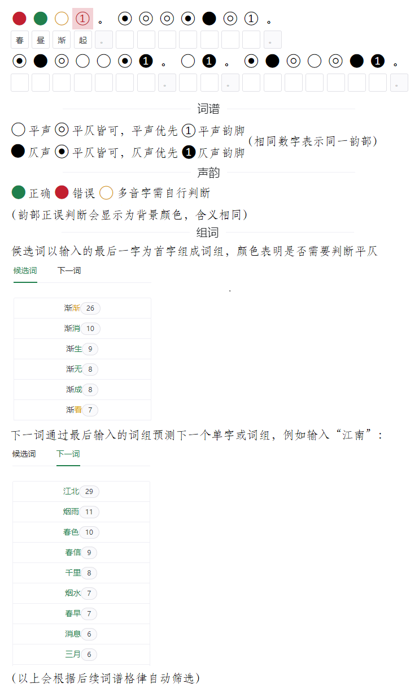

# 助词

一个简单的宋词填词工具，[点击进入](https://chienmy.github.io/SongCiApp/)。

## 功能特点

- 收录大多数词牌和作者体例
- 自动格律检查，四种韵书可选
- 不够智能但有用的组词提示

大概能满足一般的填词需求。

## 使用说明

## 重要提示

- 平仄检查：多音字请自行判断
- 韵部检查：未考虑邻韵通押情形
- 数据保存：关闭网页前务必自行保存作品

## 更新日志

- 2022-05-17：正式版1.0，增加对下一词的提示
- 2022-05-15：第二次重构版，分离数据处理逻辑，增加提示，调整配色
- 2022-05-10：第一次重构版，组合式API，组件化重构，纯静态页面
- 2022-05-04：预览版 ~~（先上线再重构）~~

## 致谢

- 界面：[Naive UI](https://github.com/TuSimple/naive-ui)
- 配色参考：[中国色](http://zhongguose.com/)
- 词牌词谱：[钦定词谱 - 吾爱诗词网](https://52shici.com/zd/cipai.php)
- 全宋词：[中华古诗词数据库](https://github.com/chinese-poetry/chinese-poetry)

---

[GPL-3.0 license](https://github.com/chienmy/SongCiApp/blob/main/LICENSE)

项目代码禁止用于比赛和商业用途
